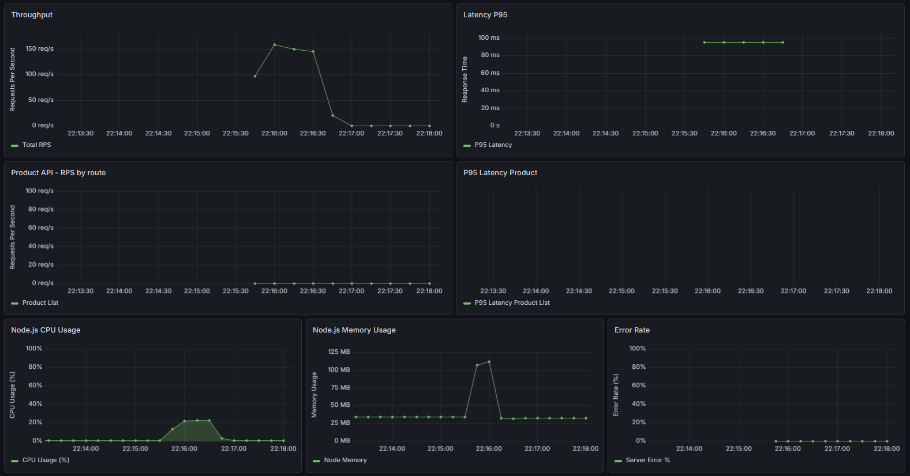
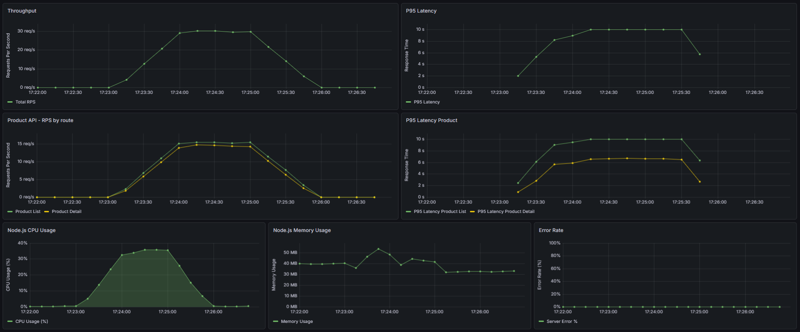
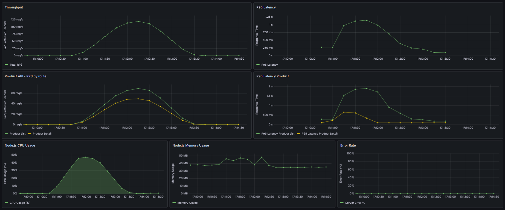
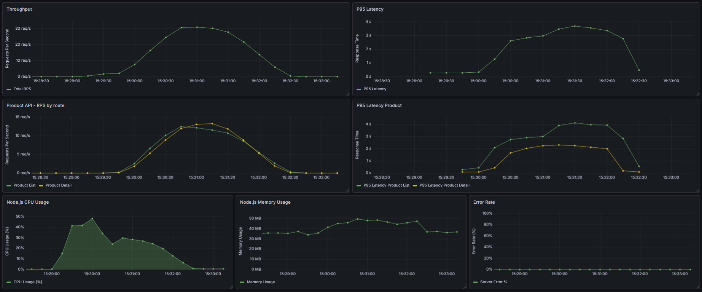

# ⚡ Performance Benchmarking & Load Testing Report

This directory contains the automated load testing suite for the Multi-Vendor Marketplace backend, powered by **k6**, **Prometheus**, and **Grafana**.

The primary objective is to verify system stability, resource utilization, and database integrity under high-concurrency scenarios (e.g., Flash Sale events).

## 📊 Test Environment & Hardware Specification

- **OS:** Windows 11 / Linux Docker Containers
- **CPU:** 11th Gen Intel(R) Core(TM) i5-1135G7 @ 2.40GHz (2.42 GHz)
- **RAM:** 16GB DDR4
- **Databases:** PostgreSQL (Prisma ORM), Redis (Cache & Rate Limiter)

---

## 🚀 Scenario 1: API Gateway Rate Limiting Defenses

**Objective:** Verify that the system successfully blocks abusive traffic (DDoS/Scraping) and maintains core stability.

### ⚙️ Configuration

- **Script:** `tests/load/rate-limit-test.js`
- **Load Profile:** High-frequency burst requests targeting public endpoints.

### 📈 Results & Artifacts

- **Total Requests Generated:** 10,023 requests (Average throughput: **~667 req/s**)
- **Allowed Requests (HTTP 200):** **~2% (200 requests)** — The system accurately allowed only the configured safe threshold to pass through.
- **Blocked Requests (HTTP 429):** **98.00% (9,823 requests)** — Abusive burst traffic was instantly intercepted and rejected by the Redis-backed Sliding Window Counter.
- **System Stability (HTTP 500):** **0% (0 requests)** — The server successfully absorbed the spam attack without any internal crashes, timeouts, or memory leaks.
- **Evidence:**

---

## ⚡ Scenario 2: Redis Caching Efficiency Benchmark

**Objective:** Measure the impact of the Redis cache-aside pattern on read-heavy operations (`GET /products` and `GET /products/:slug`) regarding latency and Database CPU relief.

### ⚙️ Configuration

- **Script:** `tests/load/redis-cache-test.js`
- **Load Profile:** Ramping up to **250 Maximum VUs** (150 VUs browsing lists, 100 VUs viewing details) over a 2-minute duration.
- **Comparison:** Running the exact same load profile with Cache Disabled (Direct DB queries) vs. Cache Enabled (Redis Hit).

### 📈 Metrics Comparison

| Metric                        | Cache Disabled (Direct DB) | Cache Enabled (Redis Hit)        | Impact / Improvement              |
| :---------------------------- | :------------------------- | :------------------------------- | :-------------------------------- |
| **Total Requests Processed**  | 3,419 requests (~28 req/s) | **10,770 requests** (~89 req/s)  | **Throughput increased by >315%** |
| **P95 Latency (View Detail)** | 5.3s                       | **59.3ms**                       | **Slashed by ~98.8%**             |
| **P95 Latency (Overall)**     | 9.91s                      | **826.53ms**                     | Massive system-wide stabilization |
| **Max Latency**               | 12.5s                      | **5.01s** _(Initial cache miss)_ | Reduced queue bottleneck          |

### 🖼️ Evidence

- **Cache Disabled (Database Bottleneck):**

  

- **Cache Enabled (High Performance):**

  

---

## 🛒 Scenario 3: High-Concurrency Mixed Workload (Flash Sale Simulation)

**Objective:** Simulate a realistic, intense E-commerce transaction funnel where multiple users concurrently browse, add items to carts, and execute checkout transactions while sellers concurrently update stock.

### ⚙️ Configuration

- **Script:** `tests/load/mixed-workload-test.js`
- **Load Profile:** Ramping up to **93 Maximum VUs** over a 2-minute duration.
- **Traffic Distribution:** 40% Browse, 30% View Details, 20% Shopping Flow (Add + Checkout), 5% Search, 5% Seller Updates.

### 📈 Core Performance Metrics

- **Total Requests Executed:** 3,104 requests (~25.14 requests/second)
- **HTTP Request Failure Rate:** **0.12%** (Only 4 requests failed out of 3104)
- **Checkout Success Rate:** **97%** (136 successful orders created atomically)
- **Database Deadlocks:** **0** (Eliminated via Ordered Locking implementation)
- **Median Latency (Read Operations):** **5.67ms** (Stabilized via Redis)

### 🖼️ System Health Metrics (Grafana Dashboard)

### 🧠 Architectural Key Takeaways

1. **Deadlock Elimination:** Initial runs triggered PostgreSQL `40P01` deadlocks due to concurrent row-locking on product stock updates. Resolved by implementing a strict **Two-level Ordered Locking mechanism** (sorting Shop IDs, then Product IDs alphabetically) within Prisma transactions.
2. **Connection Pool Optimization:** Fixed `Transaction API error: Unable to start a transaction in the given time` by nới rộng `connection_limit=50` trong database URL và tinh chỉnh cấu hình `maxWait: 10000` cho Prisma Client.
